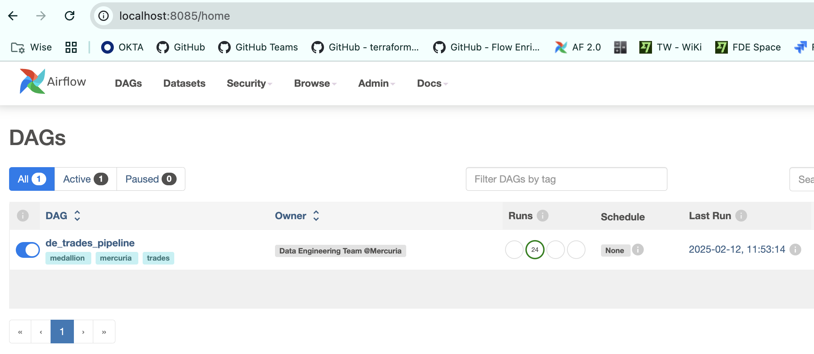
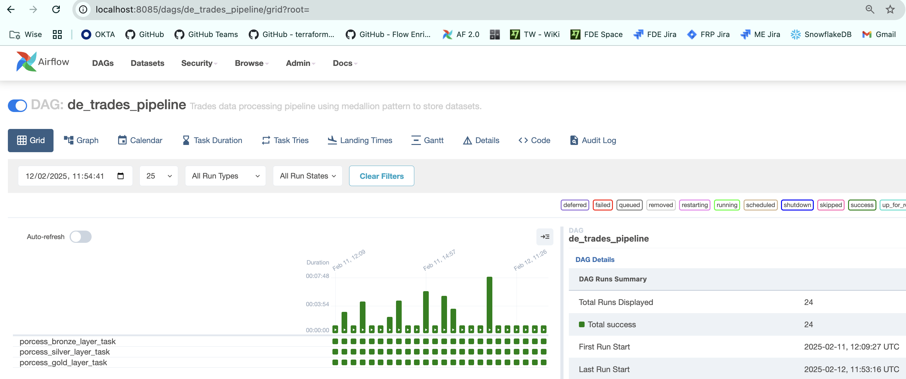
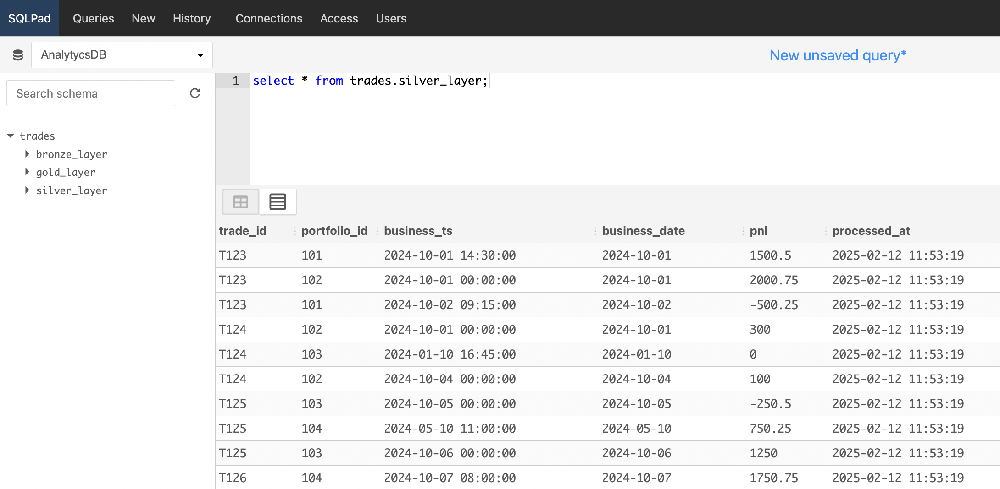
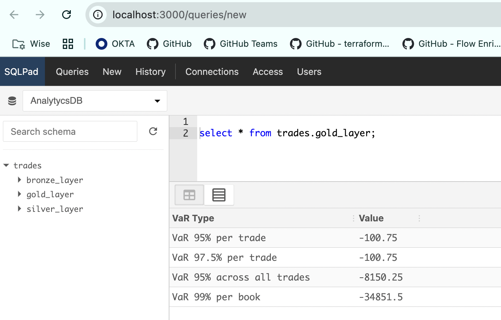
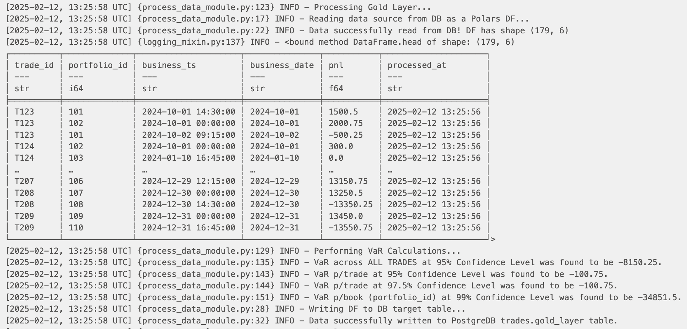

# Project Specs
To complete the Data Engineering assessment, using the **medallion pattern**, I opted to spin a Docker container with the following three services:

- **Airflow** -> Made of Webserver and Scheduler. Will be used as an orchestrator.
- **PostgresDB** -> Used to both store Airflow metadata as well as the Bronze, Silver, Gold datasets.
- **SQLPad** -> Light DBMS that allows to query datasets in PG with SQL

### Spinning The Container
Navigate to the `mercuria` folder and execute:

```bash
docker compose up -d
```

This command will launch the following services:
```bash
[+] Running 4/4
 ✔ Container postgres                                                                                            
 ✔ Container airflow_webserver                                                                                                 
 ✔ Container airflow_scheduler                                                                   
 ✔ Container sqlpad         
```
### Accessing Airflow UI

To access Airflow UI, navigate to: http://localhost:8085/login/ and type credentials:

```bash
UN = airflow
PW = airflow
```
You should be able to visualise the `de_trades_pipeline`



Now, please **trigger** the pipeline. You should observe how all 3x tasks get successfully executed:

- **porcess_bronze_layer_task** -> parses `data_engineer_sample_data.csv` and stores it in the PG DB to a table named `trades.bronze_layer`.

- **porcess_silver_layer_task** -> reads from the `trades.bronze_layer` table and applies some transformation (_formatting dates, changing data types, adding fields_) and then stores the transformed dataset to a table named `trades.silver_layer`.

- **porcess_gold_layer_task** -> reads from `trades.silver_layer` table and uses this data to compute Value At Risk. The final result is saved to a `trades.gold_layer` table.



The three datasets can be queried using SQL directly in SQLPad UI.

### Accessing SQLPad UI

To access SQLPad UI, navigate to: http://localhost:3000/login/ and type credentials:

```bash
UN = admin@sqlpad.com
PW = admin
```
You should be able to see a connection to a database named `analytics_db` and its `trades` schema.

The three tables generated by the Aiflow pipeline will appear under this schema and you will be able to query them (_2x examples below_):





### Technical Details

#### Airflow Service

Airflow was chosen to be the pipeline orchestrator. You will see that the code was organised in 2x folders to adhere to the **orchestration vs computation paradigm**:

- **dags/orchestration** -> only includes the DAG skeleton, without additional Python methods. The main application (`main_app`) is imported to the DAG and specific Class methods are passed to the PythonOperator.

- **dags/computation** -> includes the main module (`process_data_module`) where the main service (-in charge of processing data-) is defined. The module groups required methods under a dedicated `DataProcessing` class.

**NOTE**: _I tried to avoid code redundancy by modularising methods inside the `DataProcessing`. I am aware this is not top notch yet, but hopefully it gives you an idea of my resoning/coding flow._

#### PostGres DB Service

Postgres is not a DB meant to be used for analytics, but I choose it because I often work with it within Docker for testing or to develop PoC.

Interesting for you perhaps, it's to notice that I created 2x separate databases:

- **airflow_metadata_db** -> specifically to store Airflow Metadata
- **analytics_db** -> to store tables following the medallion pattern.

In particular, I made sure to create a `trades.bronze_layer` table while initialising the service, just after creating the `analytics_db`. 

This was not strictly necessary, as the table would have been created anyway while writing the `polars` DF in the first task, however I did that to test that I could visualise tables under the `trades` schema in SQLPad UI.

#### Main Application

The above mentioned `process_data_module` includes a `DataProcessing` class with a number of methods, including the ones that are in charge of processing data according to the medallion pattern:

- **process_bronze_layer()**
- **process_silver_layer()**
- **process_gold_layer()**

These methods were grouped under the same Class, as in charge of delivering a similar function, but are called separately by the `PythonOperator` in the Airflow DAG.

#### Logs (Example)

Please, find below an example of logs generated by executing the `porcess_gold_layer_task`:



**I hope I will be able to discuss it further in the following interview step.**


