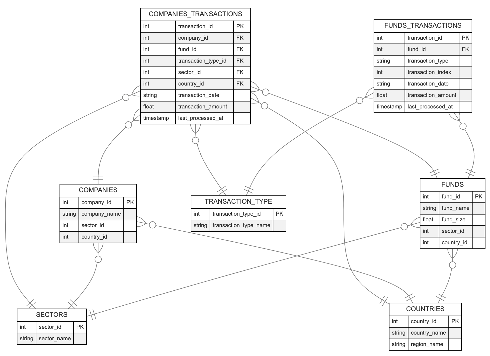
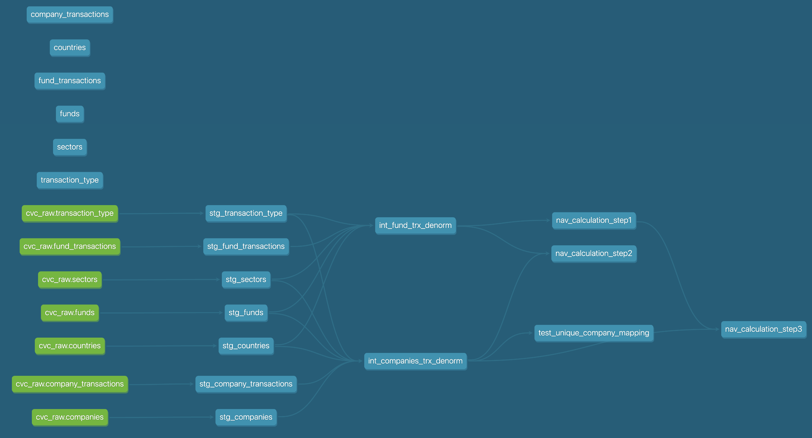
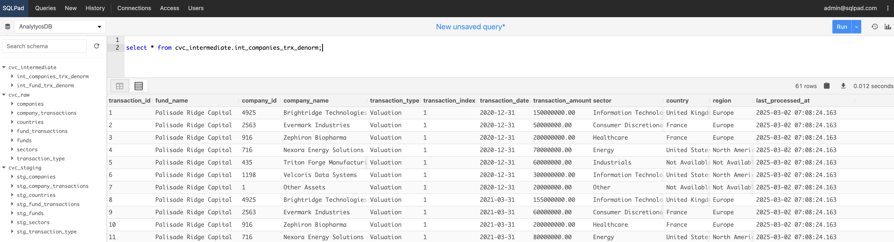
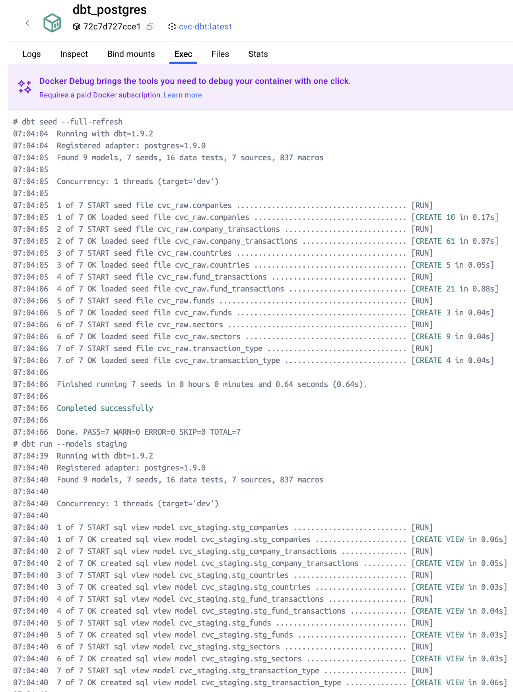
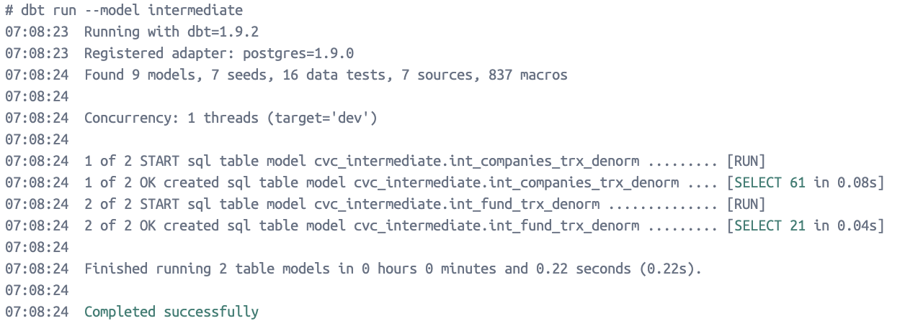
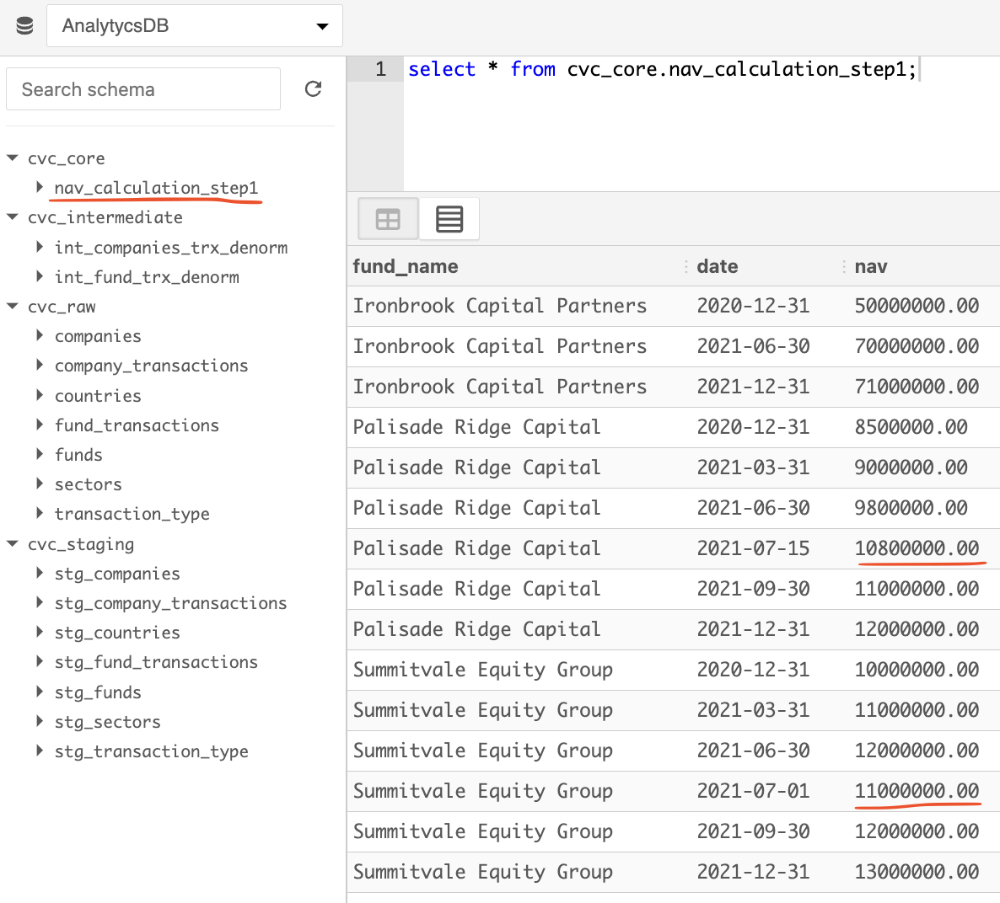
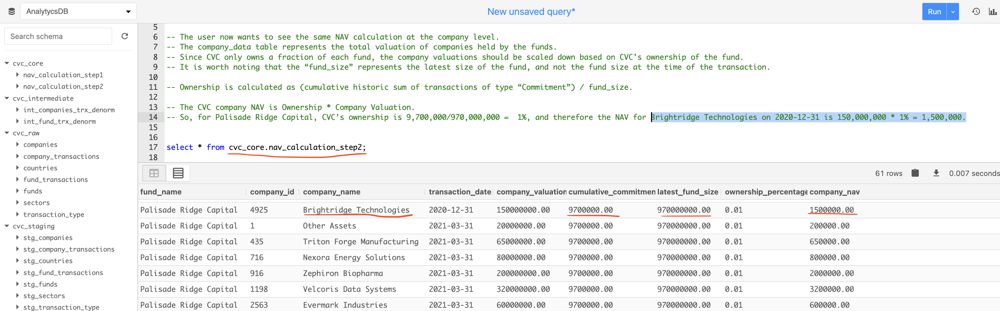

# CVC Project Specs
**Candidate:** _Antonello Benedetto_

To complete the Data Engineering assessment, I opted to spin a Docker container with the following three services:

- **DBT** -> Despite being a CLI tool, for this project, I am simulating a dbt container that runs indefinitely.
- **PostgresDB** -> Used to store tables generated via DBT commands.
- **SQLPad** -> Light DBMS that allows to query datasets in PG with SQL.

### Spinning The Container
Navigate to the `cvc` folder and execute:

```bash
docker compose up -d
```

This command will launch the following services:
```bash
 ✔ dbt                     Built                                                                            
 ✔ Network cvc_default     Created                                                                           
 ✔ Container postgres_db   Started                                                                           
 ✔ Container sqlpad        Started                                                                           
 ✔ Container dbt_postgres  Started
```

### Accessing SQLPad UI

To access SQLPad UI, navigate to: http://localhost:3000/login/ and type credentials:

```bash
UN = admin@sqlpad.com
PW = admin
```
You should be able to see a connection to a database named `analytics_db` and a list of its schemas.

### Task 1: Data Modeling
#### Request
_**Using the provided extracts, design a dimensional data model that enables efficient reporting and analytics. 
Clearly explain your choice of fact and dimension tables.
Include a schema diagram illustrating the relationships.**_
#### Answer
The model extract has been provided in Excel format. For this reason, I decided to create a source in DBT using `seed` files.

The original `fund_data` and `company_data` are two denormlised datasets that present redundant data, that should leave in mapping table instead.

For this reason I have broken down the 2x original datasets in 7x CSV files to be imported via DBT as materialised views:

- `funds.csv`
- `companies.csv`
- `countries.csv`
- `sectors.csv`
- `transaction_type.csv`
- `company_transactions.csv`
- `fund_transactions.csv`

The resulting (_normalised_) data model is the following (_link to the website [here](https://mermaid.live/edit#pako:eNrFVV1rgzAU_Sshz-0f8K30A8qYlWofNgoSTHQBk0gSYV3rf59WrR8xnWwPU1DMObkn596beIWRwAQ6kMgNRYlE7MxBea0Pr97K3W_9MDiuXH-1DvYH1wfXGgWAcg20RFyhSFPBQ4qB99IHI8EyxC8VsBsAcc6xOdqPpS8ZMRmKRFpIczwSOddyJKS0pDwZRMVIkxaOU4GGmohVYVpcU0aURiwDKVI6zKSIiFIEh6ihFPWrfu5O7ubXeTLTMbH2KiPWiByTz3_x_eiRod1e5b2xqRbjiJHJ4k5XdlL85AbHCfFHN0yI11hfvIEkSapsdIhZ4KFOWzZD5A70Feqc34cV_fqja3-7Dg7H0Vq6nWGspoEsvnotGwZv3tbetu2W9H7qUpuU5TwpxHJ5u3WoA86wvGdMqWsyn294nT-1Tfr8GV1z9udYTwurJTv3qZ3x9pzjY_bSn0UbEMxIcAEZkQxRXP5w7r12hvqDlA0DKwomMcpTXTGLkopyLfwLj6CjZU4WUIo8-YBOjFJVfuVZdbA1_6yWUp4t70KwhlR8AwCcHOQ)_):



In order to create an efficient data model, I used DBT to:

- Import data sources like seeds
- Build `stg_` views on top of raw seed files -> best practice to avoid referencing src data directly
- Build `int_` **materialised tables** using `stg_` views like sources --> best practice to perform main joins (_dernormalised reports_) + apply data cleaning/formatting.
- Applied tests on top of `intermediate` tables to guarantee data quality.

This is the DBT lineage graph generate by executing:

`dbt docs generate && dbt docs serve --host 0.0.0.0 --port 8081`



**Note:** At each step, data has been stored in dedicated schemas to also preserve lineage and auditability:
- `cvc_raw` schema for `seed` files
- `cvc_staging` schema for stg_ views
- `cvc_intermediate` for int_ tables

This is how schemas look by accessing SQLPad UI:


The screenshot below show that the following commands were executed successfully:

```bash
dbt seed --full-refresh
dbt run --models staging
dbt run --models intermediate
```



_**From a technical standpoint, what are your observations about the data extract?  + Can you identify any data quality issues or inconsistencies?**_

The data in the 2x datasets prensets the following characteristicts:

- `transaction_date` is not defined in the standardised format `yyyy-mm-dd`

- missing values for `country`, `region` ,`sector` are sometimes replaced by `N/A` and other left as blanks (depending on the `company_name`) -> hence missing values are not treated in a standardised fashion either.

- `transaction_amount` is not formatted as a `decimal(35,2)` or similar.

- in the `fund_data` dataset, the same country is referenced either using the full country name or using the country code (see `United States` vs `USA`)

- in the `companies_data` dataset, the same company (`916 - Zephiron Biopharma`) is referenced by two funds (`Palisade Ridge Capital` and `Summitvale Equity Group`) 

- in general, both datasets are denormalised and present redundant information. At the same time, both `primary_keys` and `foreign_keys` are missing.


_**What potential challenges might arise when working with this data?**_

 In order to guarantee efficent reporting and analytics whithin a professional environment, data should be split in `dimension` and `fact` tables, following the `Kimball's dimensional data modelling` principles.

This allows to:
- guarantee uniqueness of transactional data, by introducing `primary_keys`.

- join datasets using `foreign_keys` to derive denormalised models and facilitate downstream teams while extracting insights, training ML models.

- facilitate information and `schema evolution` over time, as storing data in normalised table means that only the `dimension` table itself will need to be updated, while updates will flow to the `fact` table via joins.

- store data in a normalised and efficient way, without saving the same data points multiple times. As a result, **disk space** won't be wasted, as integers used for `foreign_keys`, present a lower space complexity when it comes to storage (_particularly when compared to strings_).

The main challenge is that the original datasets **do not** follow the principles above.

Another challenge I see, could arise while comparing funds transactional data with companies transactional data. This is the case for 2x main reasons:

- there is a `1:many` relationships `funds:companies`, meaning that `companies_data` is a more granular datasets when compared to `funds_data`. However, in the original dataset, the same comapany is mapped to multiple funds (see `916 - Zephiron Biopharma`), tha leads to the second point

- there is no way to **"break-down"** the fund businesses via companies transactional data. Also there is no way to join funds and companies directly, but that happens via the transactional dataset.

_**If you were responsible for designing this data extract, what additional information would you include to improve usability?**_

As mentioned, I will definitely need to add:

- `primary_keys` as **unique keys** to allow for the `fact` tables to be updated `incrementally`, remove the risk of duplication.
- `foreign_keys` to be able to join dimension and fact tables, maintaining a noralised schema.
- `last_processed_at` (_or similar_) to also allow `incremental updates` in the DBT models. In fact, using a timestamp, will allow us to only insert "new" data or to update records already present in the datasets but that changed (same `primary_key`, but recent timestamp).
- `currency` to be transparent while reportint transaction amounts (_despite the assumption is that same functional currency is used_).

_**What would the end-to-end pipeline look like for ingesting this data into a Snowflake data warehouse?**_

Assuming we wished to rely o DBT models, I would create:

- An Airflow DAG to orcherstrate the refresh of the model based on a specific schedule.

- The DAG will be split in different tasks, like spinning dbt containers, ingesting data via seeds (Ior from different sources_), refreshing **intermediate** and **core** tables incrementally and eventually automatically perform **DBT tests**.

### Task 2: SQL Exercises
_**A user has requested a report showing the NAV of each of the funds over time. The NAV is calculated as the most recent valuation of the fund, plus any calls or distributions since that valuation. Currently, the user manually tracks NAV in Excel.**_

#### Step 1
_**Using the fund_data extract, write an SQL query to calculate these NAVs over time.**_

_**Additional Considerations: Some dates in the extract contain multiple valuations, but their significance is unclear. The user has confirmed that their Excel output is correct but is unsure how these multiple valuations should be handled. Clearly document any assumptions you make about data treatment in your SQL solution.**_

The query has been saved under `core/nav_calculation_step1.sql` and generated as permanent table via DBT. The report matches perfectly the output in the original Excel file:



**Assumptions:**
- I only considered fund trasactions related to `Valuations`, `Calls` and `Distributions`
- When more `Valuations` were present for the same date, I ranked then by `fund_name` and `transaction_index` (in `desc` order)
- In case of a `Call` or `Distribution`, I forward filled the most recent **NAV** and added (_or subtracted_) the `Call` (`Distribution`)

#### Step 2
The query has been saved under `core/nav_calculation_step2.sql` and generated as permanent table via DBT. The report matches the example calculation:



**Assumptions:**
- Only funds transactions with `transaction_type = 'Commitment'` are used to compute cumulative commitments.
- For each company valuation, the `cumulative_commitment` is the SUM of daily commitment amounts (from funds trxs) up to (and including) the company’s `transaction_date`.
- The latest `fund_size` is taken as the maximum `fund_size` per fund, regardless of transaction_date.
- Transaction amounts in both intermediate tables are assumed to be in the same **functional currency**.

#### Step 3
The query has been saved under `core/nav_calculation_step3.sql` and generated as permanent table via DBT. 

#### Step 4
_**Compare your two sets of outputs. What differences do you observe? Given that all of the data in the extract is correct, what may cause a difference in the calculation, given the two calculation methodologies?**_

- `Commitment-Based Ownership (Output 1)`: this method assumes that the ratio of cumulative commitments to the latest fund size accurately reflects the ownership percentage. It doesn’t guarantee that the sum of scaled `company valuations` will equal the actual fund NAV.

- `NAV-Proportional Scaling (Output 2)`: This method “top–down” scales the `company valuations` so that they sum exactly to the fund NAV on that date. It adjusts for any differences by recalculating the percentage on a daily basis. This means that if the company valuations collectively deviate from what the cumulative commitments would imply, the scaling factor will automatically adjust.

**Reason For Discrepancies:** the  second method method **only processes** company valuation records for which there is a corresponding fund NAV on the same fund and date. In other words, output 2 is generated by joining the companies transactions with the fund NAV data, and if a company valuation record doesn't have a matching fund NAV (i.e. the fund_nav table doesn't contain an entry for that specific date), that record is excluded from the final result -> Output 2 includes 59x records while Output 2 includes the original 61 records.

### Task 3: Testing and Data Quality in DBT
_**Write dbt tests to identify the following data quality issues:Invalid transaction_date, missing fund_name, fund_size, transaction_type, transaction_index, transaction_date or transaction_amount, duplicate companies sharing the same company_id**_

#### Answer
Required tests were built within the `models/intermediate` directory in the `int_models.yml` file at the column level.
Also, a more specific test was built in the `tests/` directory and named `test_unique_company_mapping.sql`

_**What other data tests would you recommend for this dataset?**_

- `Range and Value Distribution Tests:` ensure that numeric fields like transaction_amount and fund_size are expected bounds. Check that values such as transaction_index fall within a valid range -> `dbt-expectation`s package (e.g. `expect_column_values_to_be_between`) `Reasoning:` This helps catch data entry errors or unexpected spikes/dips, which might indicate upstream issues.

- `Data Consistency Between Models:` ensure that aggregated metrics (e.g. total transaction amounts) in the intermediate models match expectations or align with historical benchmarks. Develop custom tests that calculate aggregates or counts and compare them to previous runs or expected values (e.g.`expect_column_distinct_count_to_equal`, `expect_column_sum_to_be_between`)

_**How would you monitor data quality over time?**_

I would monitor data uality vua regular tests runs and alerts 

- `Automate Testing:` schedule dbt tests to run regularly (_via CI/CD pipelines or Airflow DAG tasks_) so that issues are flagged as data gets ingested/refreshed.
- `Set Alerts:` configure alerts or notifications (_delivered via Airflow to a Slack channel_) to inform data teams when tests fail or if key metrics fall outside acceptable ranges.

_**What edge cases should be considered in testing?**_

- `Malformed or Unexpected Date Formats:` to ensure that even if dates appear in the right format (`YYYY-MM-DD`), they are valid (e.g., not a future date or an impossible date like February 30).

- `Outlier and Anomaly Detection:` to pinpoint transactions with unusually high or low amounts that might be data entry errors. Implement tests that flag anomalies based on historical data distributions -> `dbt_expectations` package tests could be leverage more for these type of tests.


